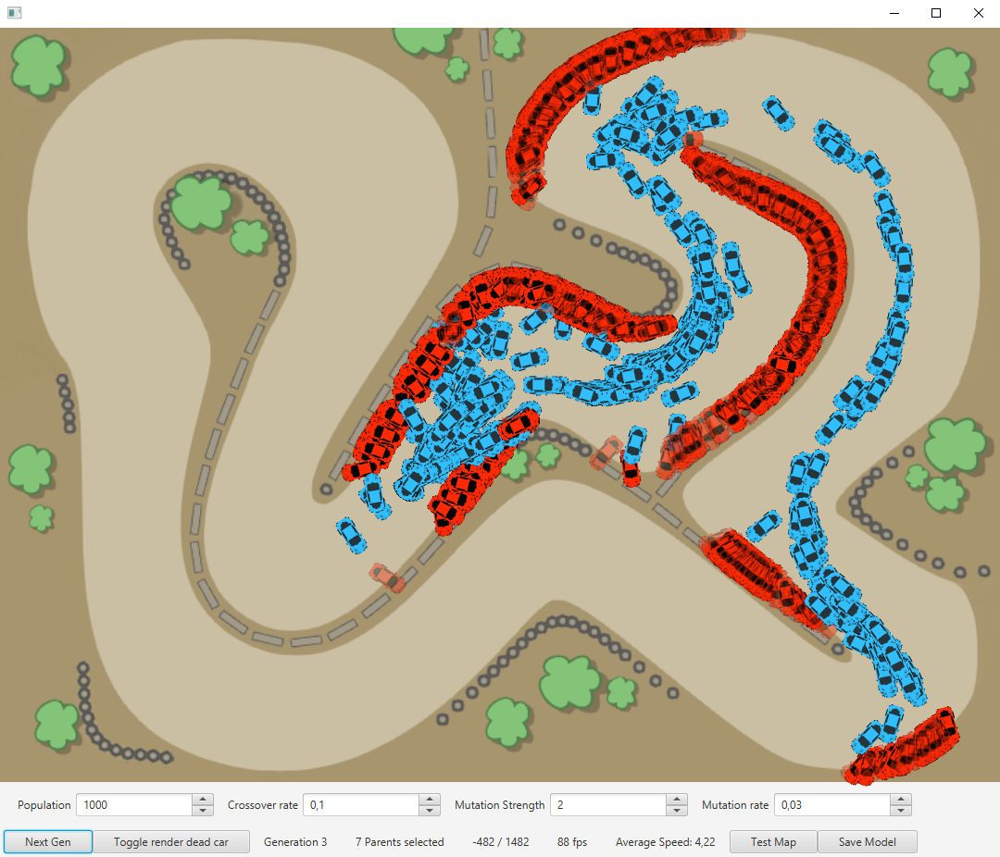

## Description
Neural networks that evolve using genetic algorithm. Cars that drove the best are selected and used for the next generation (parents). After repeating this process 5-10 times, some cars are able to drive around the track at least once.'

## Showcase

## Requirements
- JavaFX

## Bugs
- IllegalArgument sometimes when creating a new gen
- Parents are not properly included in the next gen

## Future work
- Make the selection automatic
- Add bonuses to encourage the network to use certain driving lines that are optimized for speed

# How does it work ?
Each car is assigned a neural network and has 5 "arrows" (lines from the center of the car to the nearest wall at a certain angle).
At each update the nn is fed with 9 inputs: length of each arrow (5), speed, acceleration, angle and angle speed
It gives 2 output values between -1 and 1 using a hyperbolic tangent activation function: (1) Throttle / brake (2) Turn right / left

At first, all weights and biases are random and then the following loops:
1) Select the best NNs (the ones that drove the car the furthest and fastest). These will be used as parents for the next generation
2) Create new nns by cross-overing the parents, these are added to the parents list
3) for each parent, assign a proportional number of children (population / nb of parents) and apply mutations
4) The created children become the new population
5) Let the children drive
6) Repeat

### Crossover
Merge weights and biases of two nn by taking the mean
Ex: `crossover(nn A and nn B) = (weights A + weights B) / 2`
The chances of crossover is defined by the "crossover rate"

### Mutation
Changes the weights and biases of a nn randomly
With a probability of "Mutation rate", the weight/bias `[i][j]` will be incremented by `+- (random() - 0.5) * Mutation intensity`

## Observations
A single layer network is enough, NNs that have more than 1 layer don't really 'learn' to drive. it might be because there are too much weights and biases. A higher mutation rate and/or mutation intensity might solve it.

## Results
So far, after 5-10 generations, some cars are able to drive the track.
Nevertheless, the training gets "stuck" after some time - the points listed in the Future Work section may very likely fix this.
The whole process could be improved with NEAT and auto-selection of the most performant networks (done manually at the moment)

## Params
#### Neural network
- Dimensions = (9, 20, 2)
- Activation functions: (ReLU, HyperTan)

#### Genetic algorithm
- Crossover rate: 0.5
- Mutation intensity: 2
- Mutation rate: 0.03

#### Others
- Population: up to 1500 per generation (more can cause FPS drops - highly depends on your CPU)

